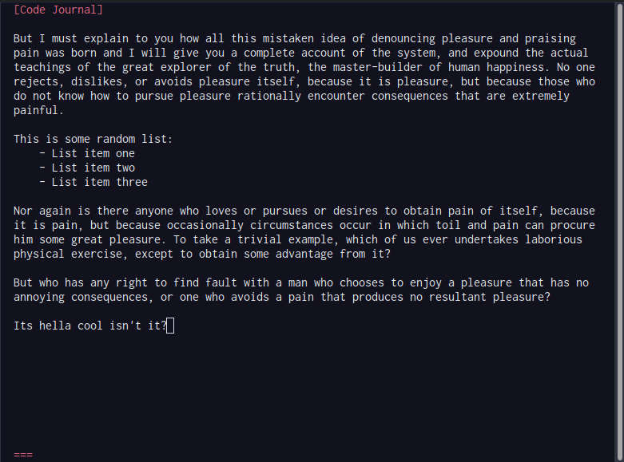

# Rust Text Editor

For educational purposes only.

Run editor: `cargo run --bin main`

No need to reboot the computer, just press the letter `q` to quit the terminal.

Q. Why the letter `q`?
- OH JUST SHUT UP!

## Screenshots:

**Important: Do not commit log.txt changes, I am too lazy to write code that creates this file on its own, and I know you all will just not go through the error to create the log.txt file on your own, so here's a disclaimer.
